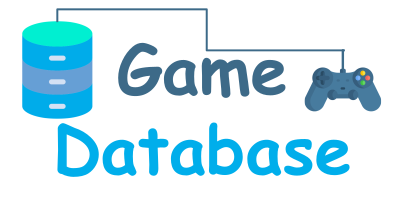
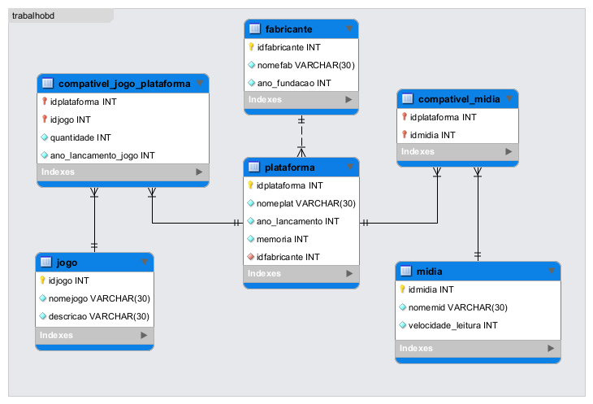

<h1 align="center">
    
</h1>

  <a href="#-projeto">Projeto</a>
    &nbsp;&nbsp;&nbsp;|&nbsp;&nbsp;&nbsp;
  <a href="#-tecnologias">Tecnologias</a>
  &nbsp;&nbsp;&nbsp;|&nbsp;&nbsp;&nbsp;
  <a href="#-esquema">Esquema</a>

## ✦ Projeto

O trabalho tem como objetivo a implementação prática dos conceitos aprendidos em sala de aula, mais precisamente, a modelagem e estruturação de um banco de dados relacional, tendo como linguagem de construção o SQL.

O contexto da aplicação se baseia em uma base de dados para um colecionador de videogames.

## ✦ Tecnologias

Esse projeto foi desenvolvido com as seguintes tecnologias e ferramentas:

- [MySQL](https://www.mysql.com/products/enterprise/database/)
- [MySQL Workbench](https://www.mysql.com/products/workbench/)

## ✦ Esquema

A seguir, a modelagem tendo como base a ferramenta SQL Workbench

    

---

O projeto foi desenvolvido, para fins didáticos, durante a disciplina de Banco de Dados do curso de Bacharelado em Ciência da Computação da UFV – Campus Florestal

